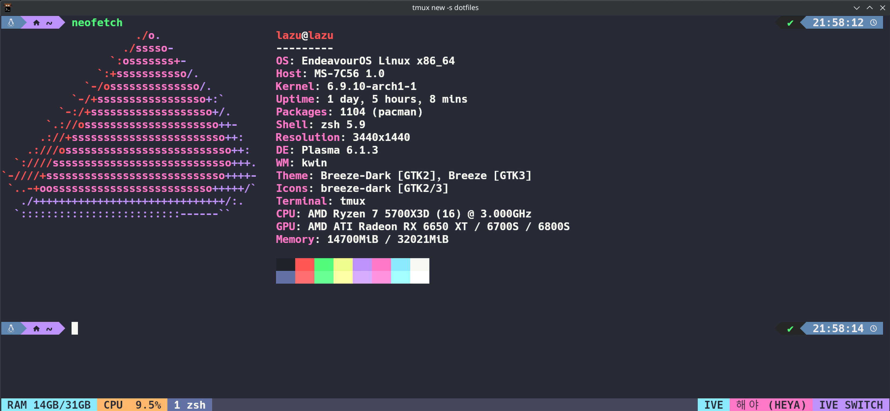
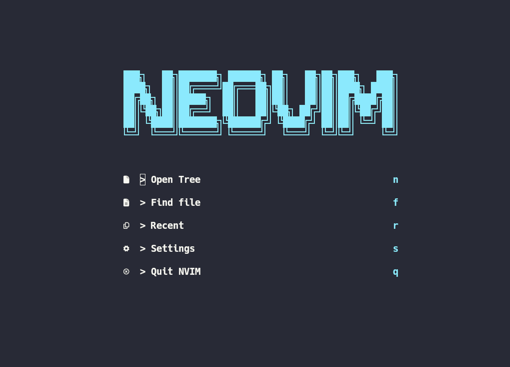

# Make your terminal beautiful



# Dotfiles

Simply setup and manage your dotfiles

- Editor: [neovim](https://neovim.io/) (best editor btw)
- Terminal: [kitty](https://sw.kovidgoyal.net/kitty/binary/) (default) or [Alacritty](https://alacritty.org/config-alacritty.html) (alternative)
- Shell: zsh
- Colorscheme: [Dracula](https://draculatheme.com)
- Workspace: tmux

# Installation

## Method 1
Install each pre-requisites and tools yourself

```bash
cd ~ && git clone https://github.com/fijar-lazuardy/dotfiles.git && cd dotfiles && stow .
```

## Method 2
Install all tools used in this repo automatically (only supports macOS and Debian based/Arch based Linux)

```bash
cd ~ && git clone https://github.com/fijar-lazuardy/dotfiles.git && cd dotfiles && bash install.sh
```
